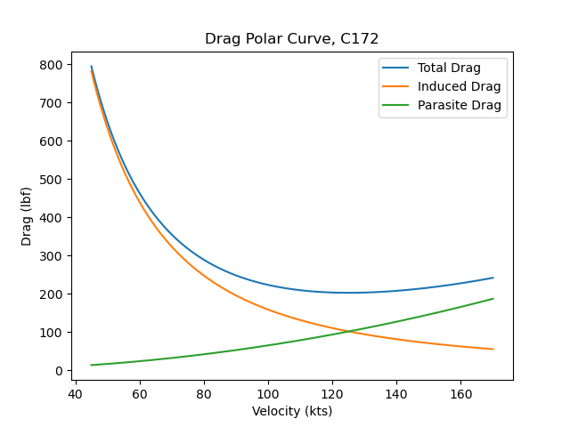
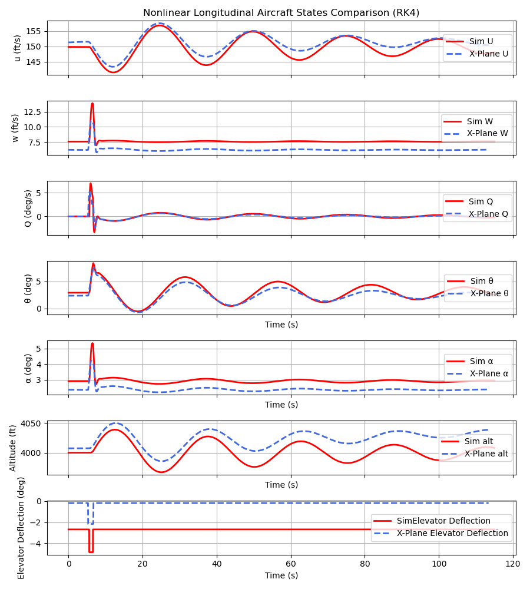

# Flight Dynamics Lab

This project is part of a broader effort to better understand aircraft dynamics, performance, and model validation by turning flight dynamics theory into working simulation tools.

## Current Features

- Nonlinear longitudinal dynamics model

- Trim solver for steady-state flight conditions

- Visualization in Matplotlib

- Custom Euler, RK2, and RK4 integrators

- Comparison to X-Plane / G-1000 style data for testing validation techniques

## Dynamics Model

The longitudinal state vector is:

$$x = [U,\; W,\; Q,\; \theta,\; h]^T$$

---

For this project, the longitudinal equations of motion in nonlinear state-space form are:

  $$\dot{U}=\frac{X}{m}-g\sin(\theta)-QW$$
  $$\dot{W}=\frac{Z}{m}+g\cos(\theta)+QU$$
  $$\dot{Q}=\frac{M}{I_{yy}}$$
  $$\dot{\theta}=Q$$
  $$\dot{h}=U\sin(\theta)-W\cos(\theta)$$

| Quantity             |   Symbol | Description                                     |
| -------------------- | -------: | ----------------------------------------------- |
| Forward velocity     |      $U$ | Body-axis velocity along the x-axis             |
| Body z-axis velocity |      $W$ | Body-axis velocity along the z-axis             |
| Pitch rate           |      $Q$ | Angular rate about the body y-axis              |
| Pitch angle          | $\theta$ | Pitch attitude                                  |
| Altitude             |      $h$ | Altitude, positive upward in the inertial frame |
| Body-axis force      |      $X$ | Force along the body x-axis                     |
| Body-axis force      |      $Z$ | Force along the body z-axis                     |
| Pitching moment      |      $M$ | Moment about the body y-axis                    |
| Pitch inertia        | $I_{yy}$ | Moment of inertia about the body y-axis         |
| Mass                 |      $m$ | Aircraft mass                                   |
| Gravity              |      $g$ | Gravitational acceleration                      |

Lift and drag are resolved into body-axis forces \(X\) and \(Z\), which are then used in the longitudinal equations of motion together with thrust.

---

### Aerodynamic Model
Lift, drag, and pitching moment are computed using a simplified coefficient-based model as functions of angle of attack, elevator deflection and pitch rate.

$$  
C_L = C_{L0} + C_{L_\alpha}\alpha + C_{L_{\delta_e}}\delta_e  
$$  
  
The drag model uses a parabolic drag polar  
  
$$  
C_D = C_{D0} +\frac{ C_L^2}{\pi eAR}
$$  
  
The pitching moment model is  
  
$$  
C_m = C_{m0} + C_{m_\alpha}\alpha + C_{m_{\delta_e}}\delta_e + C_{mq}\left(\frac{Q\bar{c}}{2V}\right)  
$$  
  
From these coefficients, the aerodynamic forces and pitching moment are computed as  
  
$$  
L = \bar{q} S C_L  
$$  
  
$$  
D = \bar{q} S C_D  
$$  
  
$$  
M = \bar{q} S \bar{c} C_m  
$$  
  
where  
  
$$  
\bar{q} = \frac{1}{2}\rho V^2  
$$

  

This formulation makes it possible to simulate the aircraft response over time and solve for trim conditions.

## Example Plots

### Drag Polar

### Longitudinal State-Response Comparison

---

## Functions
**aircraft_longitudinal_dynamics(t,x, params)**
- **t**: Timestep
- **x**: States
- **params**: Aircraft Parameters (bw, cbar, S, delta_e, throttle, m, I_yy)

