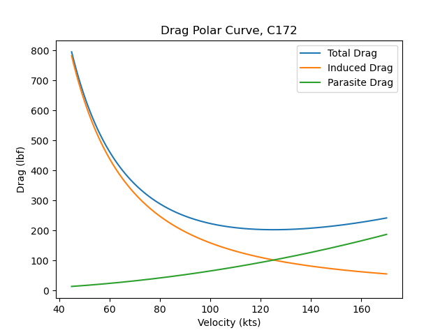
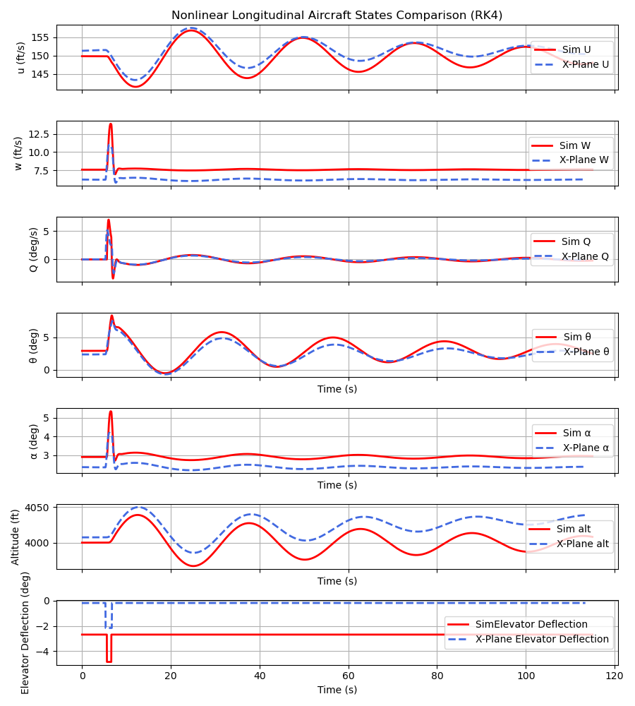

# Flight Dynamics Lab

This project is part of a broader effort to better understand aircraft dynamics, performance, and model validation by turning flight dynamics theory into working simulation tools.

The main goal is to take the equations from flight dynamics and use them to answer practical questions: Can the aircraft be trimmed at this condition? How fast can it climb? What happens after a control input or disturbance?

## Current Features

- Nonlinear longitudinal dynamics model
- Reduced nonlinear lateral-directional model about a supplied longitudinal trim condition
- Full nonlinear 12-state rigid-body dynamics with a simplified coefficient-based aerodynamic model using linear aerodynamic derivatives
- Longitudinal, lateral-directional, and six-DOF trim solvers
- Maximum airspeed and rate-of-climb calculations
- Dynamics-trim and excess-power climb methods
- Visualization in Matplotlib
- Custom Euler, RK2, and RK4 integrators
- Comparison to POH and X-Plane / G-1000 style data for testing validation techniques
- Automated pytest validation for trim, control directions, and six-DOF integration

See `docs/PROJECT_STRUCTURE.md` for the repository layout and
`docs/CONVENTIONS.md` for axes, signs, units, trim validation, and parameter status.


## Dynamics Models

There are three related nonlinear models in the project:

1. The longitudinal model describes forward, vertical, and pitching motion.
2. A reduced nonlinear lateral-directional model about a supplied longitudinal trim condition describes side velocity, roll, and yaw.
3. The six-DOF model provides full nonlinear 12-state rigid-body dynamics with a simplified coefficient-based aerodynamic model using linear aerodynamic derivatives.

The detailed equations below describe the longitudinal model, which is still the simplest place to understand how the aircraft model is constructed.

## Longitudinal Dynamics Model

The longitudinal state vector is:

$$x = [U,\; W,\; Q,\; \theta,\; h]^T$$

---

For this project, the longitudinal equations of motion in nonlinear state-space form are:

  $$\dot{U}=\frac{X}{m}-g\sin(\theta)-QW$$
  $$\dot{W}=\frac{Z}{m}+g\cos(\theta)+QU$$
  $$\dot{Q}=\frac{M}{I_{yy}}$$
  $$\dot{\theta}=Q$$
  $$\dot{h}=U\sin(\theta)-W\cos(\theta)$$

| Quantity             |   Symbol | Description                                     |
| -------------------- | -------: | ----------------------------------------------- |
| Forward velocity     |      $U$ | Body-axis velocity along the x-axis             |
| Body z-axis velocity |      $W$ | Body-axis velocity along the z-axis             |
| Pitch rate           |      $Q$ | Angular rate about the body y-axis              |
| Pitch angle          | $\theta$ | Pitch attitude                                  |
| Altitude             |      $h$ | Altitude, positive upward in the inertial frame |
| Body-axis force      |      $X$ | Force along the body x-axis                     |
| Body-axis force      |      $Z$ | Force along the body z-axis                     |
| Pitching moment      |      $M$ | Moment about the body y-axis                    |
| Pitch inertia        | $I_{yy}$ | Moment of inertia about the body y-axis         |
| Mass                 |      $m$ | Aircraft mass                                   |
| Gravity              |      $g$ | Gravitational acceleration                      |

Lift and drag are resolved into body-axis forces \(X\) and \(Z\), which are then used in the longitudinal equations of motion together with thrust.

---

### Aerodynamic Model
Lift, drag, and pitching moment are computed using a simplified coefficient-based model as functions of angle of attack, elevator deflection and pitch rate.

$$  
C_L = C_{L0} + C_{L_\alpha}\alpha + C_{L_{\delta_e}}\delta_e  
$$  
  
The drag model uses a parabolic drag polar  
  
$$  
C_D = C_{D0} +\frac{ C_L^2}{\pi eAR}
$$  
  
The pitching moment model is  
  
$$  
C_m = C_{m0} + C_{m_\alpha}\alpha + C_{m_{\delta_e}}\delta_e + C_{mq}\left(\frac{Q\bar{c}}{2V}\right)  
$$  
  
From these coefficients, the aerodynamic forces and pitching moment are computed as  
  
$$  
L = \bar{q} S C_L  
$$  
  
$$  
D = \bar{q} S C_D  
$$  
  
$$  
M = \bar{q} S \bar{c} C_m  
$$  
  
where  
  
$$  
\bar{q} = \frac{1}{2}\rho V^2  
$$

  

This formulation makes it possible to simulate the aircraft response over time and solve for trim conditions.


## Example Plots

### Drag Polar


### Longitudinal State-Response Comparison


---

## Main Functions

**`aircraft_longitudinal_dynamics(t, x, u, params, control_input=...)`**

- **t**: Current simulation time
- **x**: Longitudinal state vector $[U, W, Q, \theta, h]$
- **u**: Input vector `[throttle, elevator]`
- **params**: Aircraft geometry, mass properties, and aerodynamic coefficients
- **control_input**: Selected elevator input function

**`aircraft_six_dof_dynamics(t, x, u, params, ...)`**

- **x**: Full state vector $[U, V, W, P, Q, R, \phi, \theta, \psi, north, east, h]$
- **u**: Input vector `[throttle, elevator, aileron, rudder]`

The trim solvers accept aircraft parameters explicitly and return
`(trim_state, trim_control, scipy_result)`:

```python
longitudinal_trim(x0, trim_target, aircraft_params, verbose=True)
lateral_trim(x0, longitudinal_state, trim_target, aircraft_params, verbose=True)
six_dof_trim(x0, trim_target, aircraft_params, verbose=True)
```

The SciPy result includes raw residuals, the raw residual norm, bound-proximity
information, and a `trim_valid` flag. Invalid high-residual solutions raise
`TrimConvergenceError`.

The main performance solvers are:

```python
airspeed_max(...)
max_ROC(...)
```

